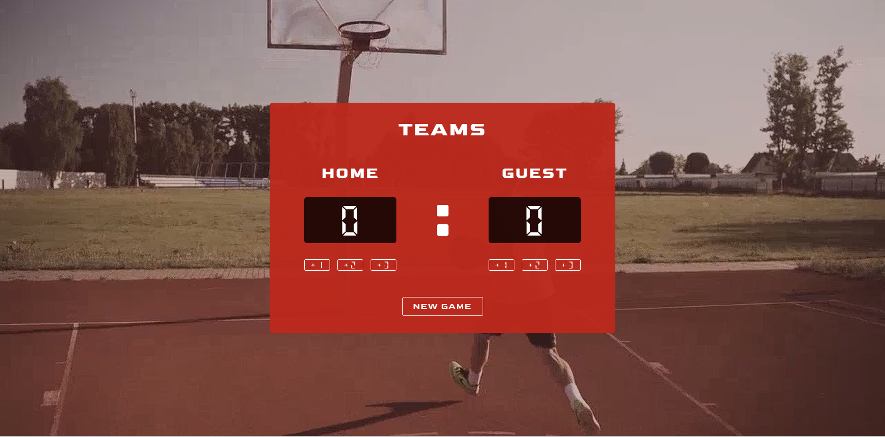

# BasketBall - ScoreBoard-App

This is a [Scrimba's](https://www.scrimba.com/) The Front Developer Path course challenge project.

## Table of contents

- [Overview](#overview)
  - [The challenge](#the-challenge)
  - [Screenshot](#screenshot)
  - [Links](#links)
- [My process](#my-process)
  - [Features](#features)
- [Author](#author)

## Overview

### The challenge

Users should be able to:

- Build Responsive BasketBall ScoreBoard App
- Build and Use ADD functions

### Screenshot

### Links

- Solution URL: [GitHub](https://github.com/sevvy-thewebcoder/scoreboard-app)
- Live Site URL: [ScoreBoard-App](https://basketball-scorecounter.netlify.app/)

## My process

### Features

- Vanila JS
- JS functions
- Semantic HTML5 markup
- CSS custom properties
- CSS Flex-box
- Mobile-first workflow

## Author

- LinkedIn - [@webcodersevvy](https://www.linkedin.com/in/webcodersevvy/)
- Instagram - [@webcodersevvy](https://www.instagram.com/webcodersevvy/)
- Frontend Mentor - [@sevvy-thewebcoder](https://www.frontendmentor.io/profile/sevvy-thewebcodersevvy/)
- Twitter - [@webcodersevvy](https://www.twitter.com/webcodersevvy/)